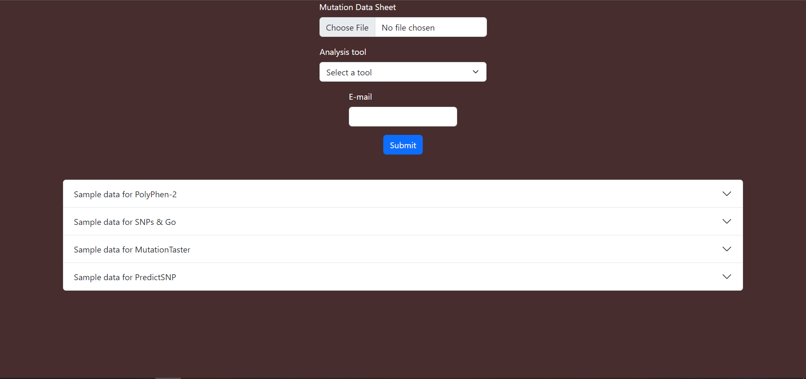

# SNPify
SNPify is a tool that automates batch processing for multiple bioinformatics tools upon large datasets. The user just needs to input a xlsx, xls, or csv file in a defined format and run the service. The results will be stored on you disk under the ~/SNP Results/ directory.

# Usage instructions
## Availability
You can download the contents of this repository in a zip file and extract it. Also, you can clone the repository. 
Once the source code is available on your disk, from inside that directory run the following command in your terminal:

``pip install -r requirements.txt``
> Make sure your python version >= 3.9

Once all the dependencies are resolved, run the following command to start the server:

``python manage.py runserver``
> Make sure you are inside the source code directory when you run this command

This will run the server on your machine's localhost on port 8000. Use any browser of your and navigate to the address http://127.0.0.1:8000 to access the application.

## Usage

The landing page has two options for analysis:
* Structural (including HOPE server and Missense-3D)
* Functional (including PolyPhen-2, MutationTaster, SNPs & Go and PredictSNP)

Choose any analysis and you will be taken to the form for uploading data. The sample format of the data each tool expects is provided right below the form. Please make sure that the data you are entering the form complies with the sample data provided. After file upload and selection of tool for analysis, press the submit button to start the service. 
> It is recommended to not input an exceptionally large amount of data like 1000 rows in an excel file. This is because the process is CPU intensive and will consume resources for a longer time which might lead to connection timeouts for system slowdown. Ideally put 100 rows per job submission and do not invoke multiple tools at once.

Once the job is submitted, you can close the browser **but do not close the terminal from where the server is started**. Closing the terminal will lead to termination of the process. You might see logs on the terminal as your jobs are running, do not worry that is an expected response.

PredictSNP is a special case as it does not produce results right away. The email field is not required for other tools, but is mandatory in PredictSNP submissions. The jobs are queued on their server, and you will get an email once they are ready. After that, come back to the application and a button to refresh PredictSNP jobs will be present, click on that button and your results will be fetched from their database.